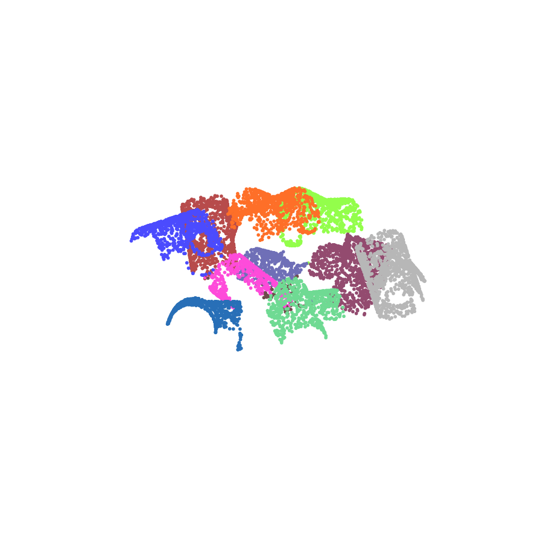
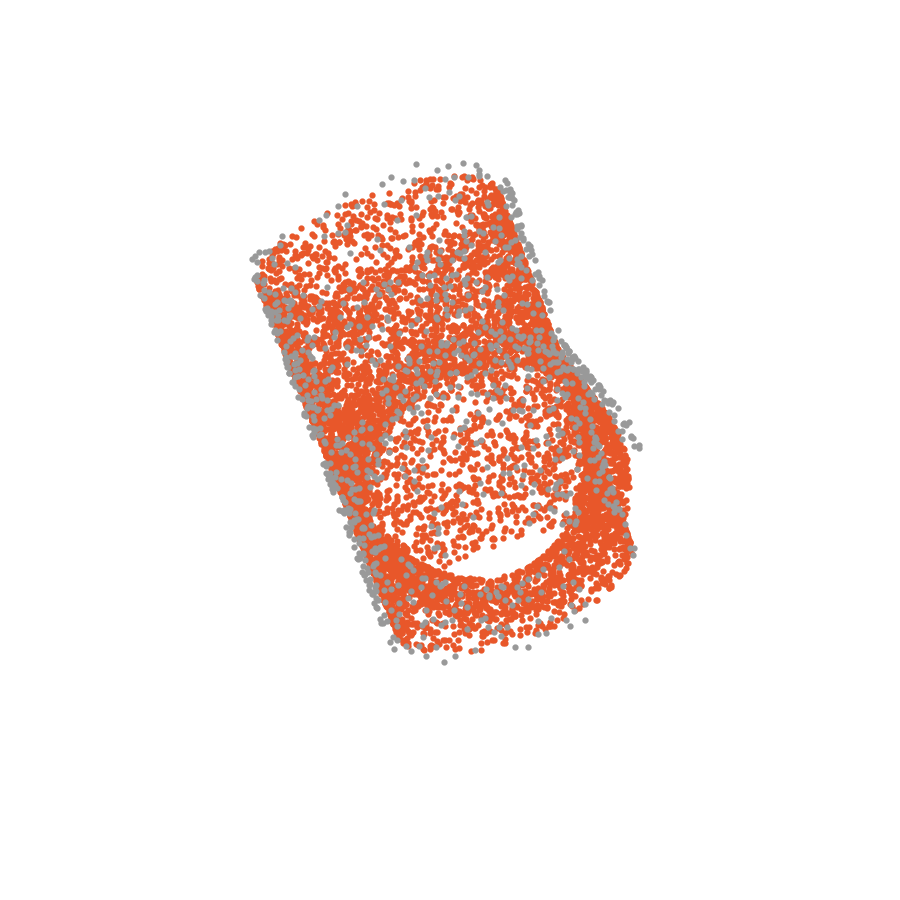

# 3D Bin-Picking: Synthetic Data Generation, Instance Segmentation & Pose Registration

An end-to-end bin-picking pipeline: starting from a single CAD model, it generates a synthetic training dataset, segments individual object instances out of a cluttered point-cloud scene, and estimates the 6D pose of each instance for pick-up.

<p align="center">
  
  
</p>
<p align="center"><em>Left: instance segmentation of a cluttered scene (each color = one detected object). Right: PPF pose registration — the CAD model (orange) aligned onto one segmented instance (gray).</em></p>

## Method

Diploma thesis (2023) implementing a full bin-picking pipeline in four stages:

1. **Synthetic dataset generation** (`DatasetGeneration/`) — starting from a single CAD model (`TJoin.stl`), renders many synthetic cluttered-bin scenes with per-point ground-truth instance labels, avoiding the need to manually label real scan data.
2. **Instance segmentation** (`Segmentation/`) — a point-cloud deep network (FPCC, PointNet/DGCNN backbone) trained on the synthetic data to segment individual object instances out of a cluttered scene point cloud. The network architecture and implementation are adapted from the published FPCC method (Xu et al., 2022 — see Credit below), ported from TensorFlow 1.x to 2.x and trained from scratch on my own generated + IPA bin-picking datasets.
3. **Pose registration** (`Registration/`) — Point Pair Features (PPF) matching to align the CAD model onto each segmented scene instance and recover its 6D pose.
4. **Result**: one aligned CAD pose per detected object in the bin, ready to hand off to a pick-up planner.

## Results

Full quantitative evaluation (segmentation accuracy, registration error) is in the thesis: [`2023_MarekSoos_DP_192398.pdf`](2023_MarekSoos_DP_192398.pdf).

## Credit

Instance segmentation is based on **FPCC**: Xu, Y.; Arai, S.; Liu, D.; Lin, F.; Kosuge, K. *"FPCC: Fast point cloud clustering-based instance segmentation for industrial bin-picking."* Neurocomputing, 2022, vol. 494, p. 255-268. [doi:10.1016/j.neucom.2022.04.023](https://doi.org/10.1016/j.neucom.2022.04.023). The reference implementation was ported to TensorFlow 2.x and retrained end-to-end on data generated for this thesis.

## Running it

The pipeline is driven by `BinPicking` in [`main.py`](main.py), run stage by stage (uncomment each block in `__main__` in order):

```python
binPick = BinPicking()

binPick.GenerateDataset(nameCadObject="TJoin.stl")
binPick.FPCC_StartTrain(checkpointFolderName="T_join_trained_NN", trainingFileList=...)
binPick.FPCC_StartPredict(checkpointFolderName="T_join_trained_NN", testDir=...)
binPick.FPCC_PredictedSegmentsDevideIntoSeparatedFiles()

binPick.PPF_GetResultsFromSegmentation()
binPick.PPF_TrainLoadModel(modelName="Registration/data/T_join.ply", loadPPFModel=True, loadPPFModelName="T_join_ppfModelSaved_409.pkl")
clustered, recomputed = binPick.PPF_MatchScene(sceneName="Registration/data/PLY_Normals/Result_Segment_1.ply")
binPick.PPF_Visualization5MatchesFromLastSegment(recomputed)
```

Dependencies: `pip install -r requirements.txt`.

## Tech

Python, TensorFlow, Open3D, NumPy, scikit-learn, Point Pair Features (PPF) registration.
